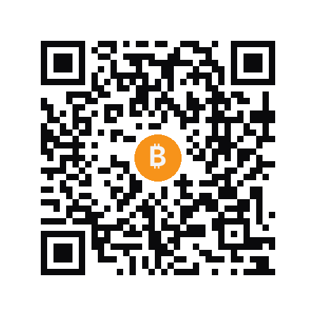

# Donate

If FinSec Lab projects helped you, a tip keeps them independent.

Scan a QR code with your wallet or tap an address to copy.

&nbsp;

## Bitcoin



**BTC** — Bitcoin

```
bc1qy3mz4rz5pw0tuv92kf74vapq9s4c9s9g42k9yn
```

<br clear="left"/>

&nbsp;

## Ethereum · Polygon · BNB Chain · Arbitrum · Optimism


**ETH** · **USDT** · **USDC** · **BNB** — any EVM chain

```
0xdeA0C7435d0673bdE12a64582F6f5210faaC2871
```

Works on every EVM-compatible chain: Ethereum mainnet, Polygon, BNB Smart Chain, Arbitrum, Optimism, Base, Avalanche C-Chain.

<br clear="left"/>

&nbsp;

## TRON


**TRX** · **USDT** (TRC-20) · **USDC** (TRC-20)

```
TQTpbJLBekbfwmn4hKBVgLdpMfZFhEgGWX
```

<br clear="left"/>

&nbsp;

## Solana


**SOL** · **USDC** (SPL) · **USDT** (SPL)

```
DuzbxFRYCoxKgehMgUWRtoDKszDrnn6U2cvJg8jJASRG
```

<br clear="left"/>

&nbsp;

## Bank transfer (SEPA)

| | |
|---|---|
| Beneficiary | Bryan Horvath |
| IBAN | `MT24 CFTE 2800 4000 0000 0000 0581 9627` |
| BIC / Swift | `CFTEMTM1` |

&nbsp;

---

<div align="center">

<sub>Thank you. · FinSec Lab</sub>

</div>
