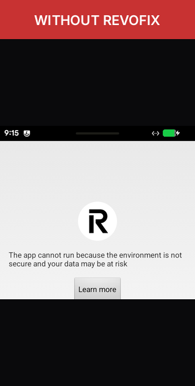

<div align="center">

# Revofix

A one-tap fix that lets Revolut run on your rooted phone.



[](https://github.com/Finsec-lab/Revofix/releases/latest)
[](https://github.com/Finsec-lab/Revofix/releases/latest)
[](LICENSE)

</div>

### Install
```
adb install -r Revofix.apk
```
Open the app → **Grant** → **Install** → **Reboot**.

### Requires
Magisk, KernelSU or APatch · Android 8 +

### Privacy
No permissions. No network. Per-process scope.

### Donate
If Revofix helped you, a tip keeps it independent.

| | |
|---|---|
| **BTC** | `bc1qxyzplaceholderfinseclab000000` |
| **ETH** | `0x0000000000000000000000FinSecLab` |
| **USDT** (TON) | `UQ_FinSecLab_TON_Placeholder000` |
| **IBAN** | `XX00 0000 0000 0000 0000 00` |

### Contact
[Telegram](https://t.me/FinSecLab) · [GitHub](https://github.com/Finsec-lab)

<div align="center">

MIT — © FinSec Lab

</div>
