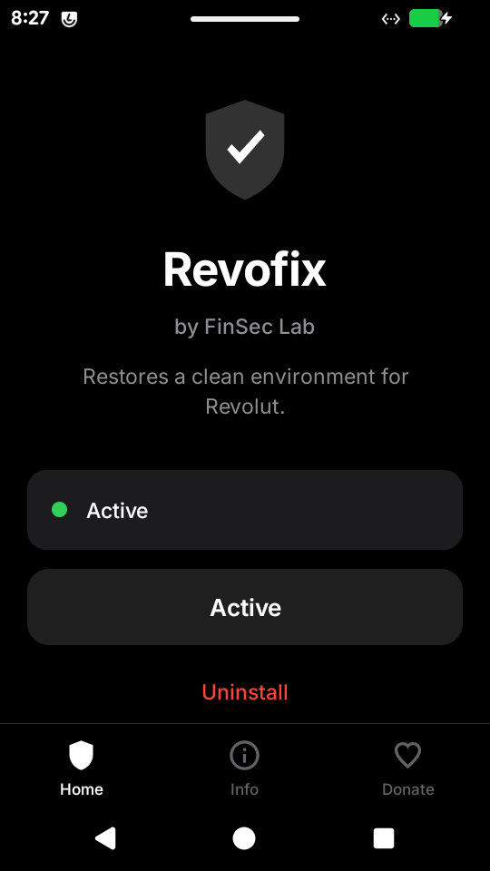

<div align="center">

# Revofix

Restores a clean environment for Revolut on rooted Android devices.

[](https://github.com/Finsec-lab/Revofix/releases)


[](LICENSE)



</div>

&nbsp;

## What it is

Revofix is a small one-tap installer for a Magisk module that gives Revolut a
clean view of the device. It does not modify Revolut, does not run network
code, and does not touch other apps.

Some banking apps refuse to launch on devices that look modified — even when
the device is fully functional and the user is the rightful owner. Revofix
restores the environment those apps expect to see, on a per-process basis,
without affecting the rest of the system.

## Requirements

- Root via Magisk 27.0+, KernelSU, or APatch
- Android 8.0 – 16 (API 26 – 36)
- arm64-v8a or armeabi-v7a

## Install

Grab the APK from [Releases](https://github.com/Finsec-lab/Revofix/releases),
or:

```
adb install -r Revofix-1.0.3.apk
```

Open the app, tap **Grant root access**, tap **Install**, tap **Reboot now**.
Open Revolut.

If you prefer to flash the module directly in Magisk Manager,
`Revofix-module-1.0.3.zip` is also attached to the release.

## How it works

For Revolut (and the DexProtector envchecks test app) and nothing else:

- Zygisk injects a small companion library into the target process before any
  app code runs.
- Per-process unmount of `/data/adb`, `/sbin/.magisk`, and module mount points
  in that one process's mount namespace.
- libc PLT hooks on `open`, `openat`, `stat`, `lstat`, `access`, `readlink`
  redirect six paths to sanitized copies (`/proc/cmdline` and the build.prop
  files across `system`, `vendor`, `product`, `system_ext`, `odm`).
- At boot, a service script normalizes ~25 system properties that anti-tamper
  engines read (`ro.boot.verifiedbootstate`, `ro.boot.flash.locked`,
  `ro.build.tags`, `ro.debuggable`, etc.).

Every other app on the device sees the unmodified system, exactly as before.

## Privacy

- The APK declares **zero** Android permissions. Verified by
  `aapt2 dump permissions`.
- No network code inside the app. The only outbound action is a system browser
  intent when the user taps a Contact row.
- No reads of contacts, SMS, location, files, accounts, clipboard, microphone,
  camera, or installed-app list (beyond a fixed two-package check before adding
  to the Magisk denylist).
- No analytics, telemetry, crash reporting, or remote configuration.
- No modification of system partitions. All bind-mounts are overlay-only;
  uninstall = stop bind-mounting on next boot.

## Compatibility

| Platform | Status |
|---|---|
| Magisk 27.0+ (Topjohnwu) | tested |
| Kitsune Magisk (vvb2060) | tested |
| Magisk Delta (huskydg) | tested |
| KernelSU | install path supported |
| APatch | install path supported |
| Android 8.0 – 16 | supported |
| arm64-v8a / armeabi-v7a | supported |

## Contact

- GitHub — [github.com/Finsec-lab](https://github.com/Finsec-lab)
- Telegram — [t.me/FinSecLab](https://t.me/FinSecLab)

## License

Released under the MIT License. See [LICENSE](LICENSE).

Distributed as binary releases only; source code is not included in this
repository.
